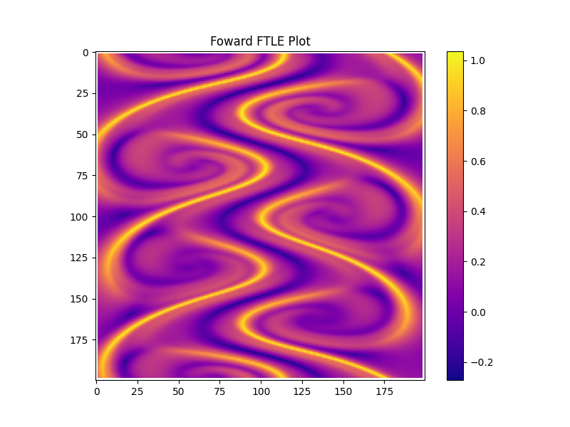
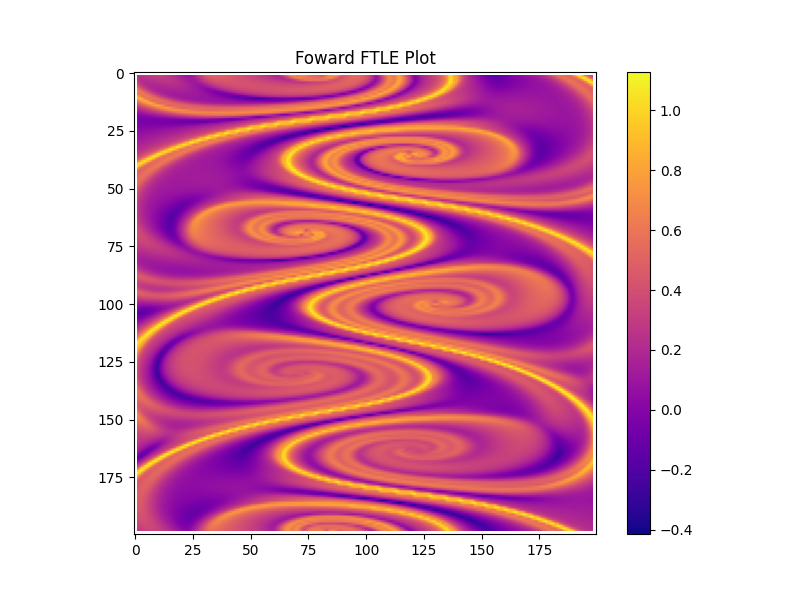

<!DOCTYPE html>
<html>
<head>
  
  
</head>
<body>
  <h1>Test</h1>
  
GitHub Pages hosting.

  
Testing.

  
IMAGE:

  
  
  

  <!-- Inline LaTeX -->
  
Display equation:

  
Inline equation: \( E = mc^2 \)

  
  <!-- Display LaTeX -->
  
Display equation:

  
$$ \int_{a}^{b} f(x)\, dx = F(b) - F(a) $$

  
</body>
</html>

